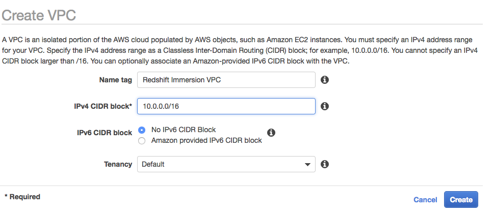
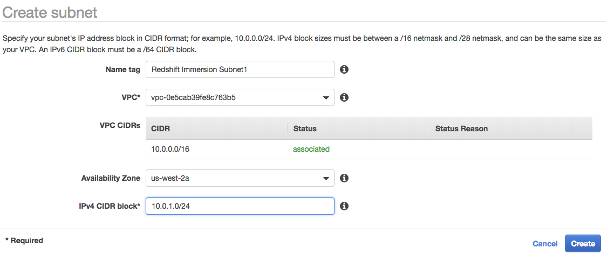
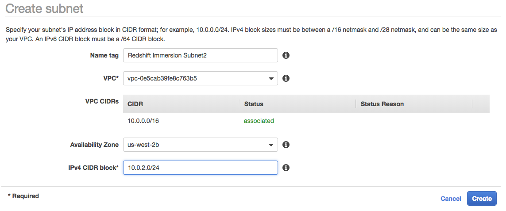
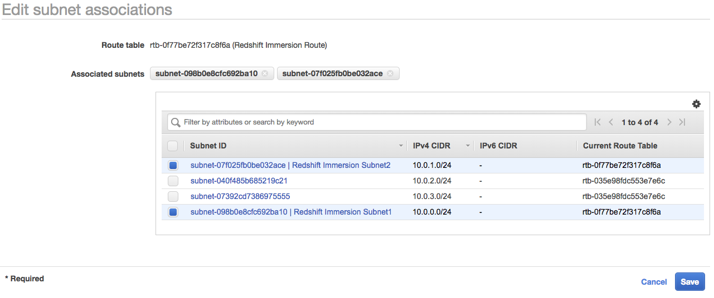
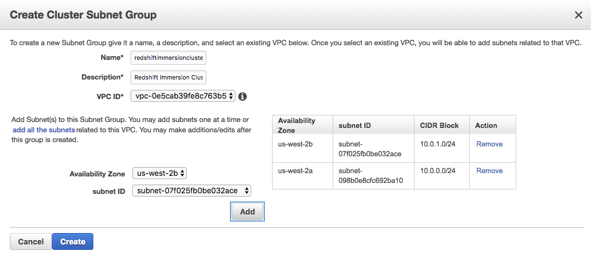
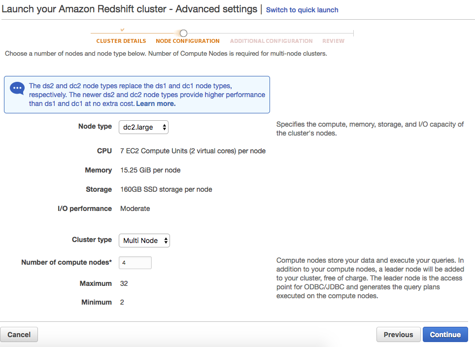
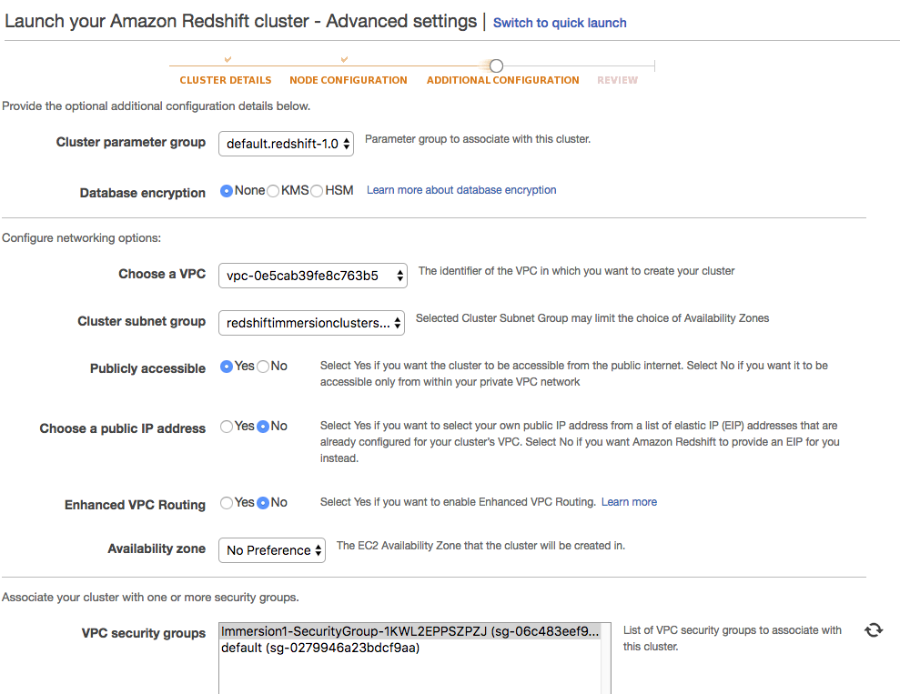
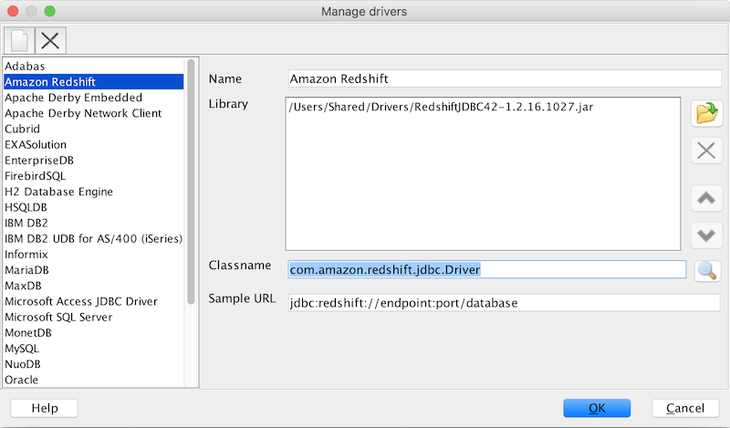
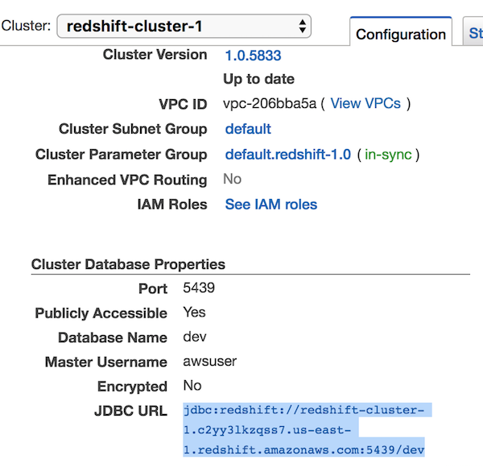
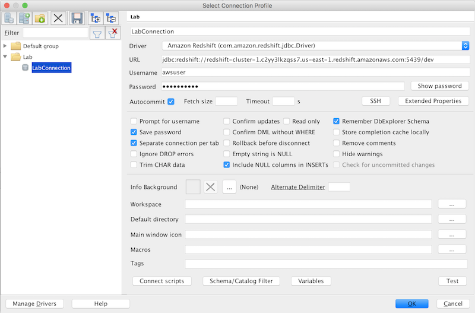

# LAB 1 - Creating Redshift Clusters
In this lab you will launch a new Redshift Cluster, setup connectivity and configure a JDBC Client tool.

## Contents
* [Before You Begin](#before-you-begin)
* [Prerequisites](#prerequisites)
* [Cloud Formation](#cloud-formation)
* [Configure Security](#configure-security)
* [Launch Redshift Cluster ](#launch-redshift-cluster)
* [Configure Client Tool](#configure-client-tool)
* [Run Sample Query](#run-sample-query)
* [Before You Leave](#before-you-leave)

## Before You Begin
* Determine and capture the following information and login to the [AWS Console](https://console.aws.amazon.com/). If you are new to AWS, you can [create an account](https://portal.aws.amazon.com/billing/signup).
  * [Your-AWS_Account_Id]
  * [Your_AWS_User_Name]
  * [Your_AWS_Password]
* Determine the [AWS Region Name] and [AWS Region Id] which is closest to you and switch your console to that [Region](https://docs.aws.amazon.com/AmazonRDS/latest/UserGuide/Concepts.RegionsAndAvailabilityZones.html).  

## Prerequisites
* While Amazon Redshift does provide a web-based [Query editor](https://console.aws.amazon.com/redshift/home?#query:) for executing simple queries which complete in under 3 minutes, for these labs, it is recommended you install a third-party tool.  We will use [SQL Workbench/J](http://www.sql-workbench.net).
* Once you have installed your third-party tool, you will need either a JDBC or ODBC driver.  Amazon Redshift offers JDBC and ODBC drivers for download. See [Connecting to an Amazon Redshift Cluster Using SQL Client Tools](https://docs.aws.amazon.com/redshift/latest/mgmt/connecting-to-cluster.html) from the Amazon Redshift Documentation website.

## Cloud Formation
To launch this cluster and configure security automatically using cloud formation, use the following link and skip ahead to [Configure Client Tool](#configure-client-tool).  
[](https://console.aws.amazon.com/cloudformation/home?#/stacks/new?stackName=ImmersionLab1&templateURL=https://s3-us-west-2.amazonaws.com/redshift-immersionday-labs/lab1.yaml)

## Configure Security
### VPC
Create or identify a VPC where you will launch your Redshift cluster.  For our purposes we will [Create VPC](https://console.aws.amazon.com/vpc/home?#CreateVpc:) to isolate the traffic.

### InternetGateway
Create or identify an Internet Gateway.  For our purposes we will [Create Internet Gateway](https://console.aws.amazon.com/vpc/home?#Create%20Internet%20Gateway:).

### Subnets
Create or identify a subnet with a default route to an Internet Gateway.  For our purposes we will [Create Subnet](https://console.aws.amazon.com/vpc/home?#CreateSubnet:) attached to the previously created VPC in two different Availability Zones to improve fault tolerance.


### Route Table
If you have created new subnets, you must [Create Route](https://console.aws.amazon.com/vpc/home?#CreateRouteTable:) with the default route pointed to the internet gateway and with the new subnets added.



### Subnet Group
Create a Redshift [Cluster Subnet Group](https://console.aws.amazon.com/redshift/home?#subnet-groups:cluster=) containing the two subnets you created earlier.

### Security Group
Create a [Security Group](https://console.aws.amazon.com/vpc/home#SecurityGroups:sort=groupId) associated to the VPC you created earlier.  Edit the Security Group to create a rule which allows incoming connections from your IP Address.
### S3 Access
Create an [IAM Role](https://console.aws.amazon.com/iam/home?#/roles$new?step=type) with the type "Redshift" and the use-case of "Redshift - Customizable" and attach the AmazonS3ReadOnlyAccess policy to the role.


## Launch Redshift Cluster
Navigate to the [Amazon Redshift Dashboard](https://console.aws.amazon.com/redshift) and click on the "Launch Cluster" button.  
* Cluster Details - Enter values as appropriate for your organization.  Note the Master user password as you will not be able to retrieve this value later.  
* Node Configuration - Modify the Cluster type to Multi Node and set the Number of compute nodes to 4.  
* Additional Configuration - Choose the VPC, Subnet Group, VPC Security group, and Role which you identified or created earlier.  

## Configure Client Tool
* Launch SQL Workbench/J and setup the Redshift JDBC Driver (see [Prerequisites](#prerequisites) for more details on downloading and installing these tools).
* Navigate to [File | Manage Drivers] and select "Amazon Redshift" and set the driver Library location. Click Ok.  
* Navigate to [File | Connect Window] to create a new connection profile and modify the following settings and once complete click on the "Test Connection" button.
  * Name - "LabConnection"
  * Driver - Amazon Redshift (com.amazon.redshift.jdbc.Driver)
  * URL - Find this by navigating to the [Cluster List](https://console.aws.amazon.com/redshift/home?cluster-details:#cluster-list:), selecting your cluster, and copying the JDBC URL.  
  * Username - [Master user name]
  * Password - [Master user password]
  * Autocommit - Enabled



## Run Sample Query
* Run the following query to list the users within the redshift cluster.  
```
select * from pg_user
```
* If you receive the following results, you have established connectivity and this lab is complete.  


## Before You Leave
If you are done using your cluster, please think about decommissioning it to avoid having to pay for unused resources.
